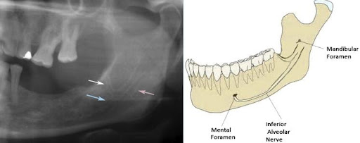
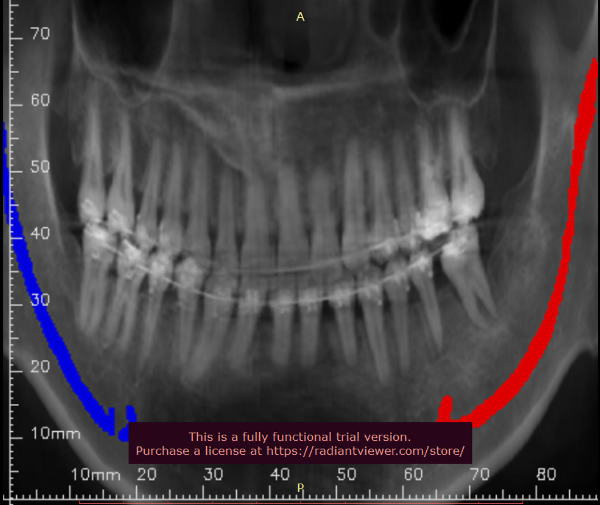
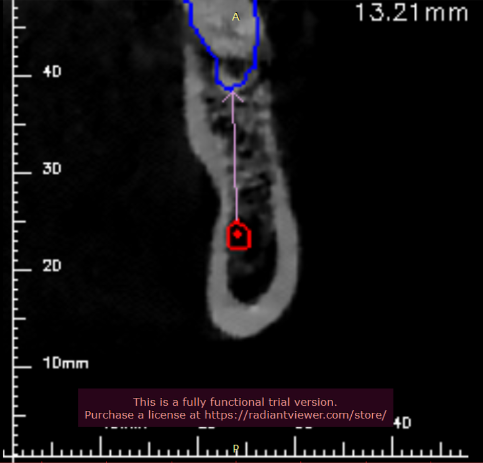

# Mandibular-Canal-Segmentation
# Canal-Segmentation Introduction
The human mandible, also known as the lower jaw, is a complex anatomical structure and it is the only movable bone in the facial area. This bone facilitating the function of facial expression and speech. More important structures are the two mandibular canals which are located underneath the teeth. The anatomy of canals constitutes the two openings which are called mandibular foramen and mental foramen as shown in figure 1 Mandibular is responsible for motor and sensory innervations to muscleand teeth respectively.

Fig 1: Anatomy of Mandibular canal
For 3D diagnostic and operation planning, cone beam computed tomography (CBCT) is widely used in dentomaxillofacial radiology. CBCT allows accurate imaging of hard tissue with less radiation dosage and it is more cost-effective and easily available. Mandibular canal location is of prime importance in dental implantology as before surgical operation the location, place, and size of implant should be determined. And the popular approach is to segmentation of canal across the cross-sectional slices using 3D imaging software. The labeling is very tedious and time- consuming thus there is a need for automated methods to do that cumbersome task.
This programme automatically segments out the mandibular canals and presents the results through various views including Panorama and Para-sagittal view.

